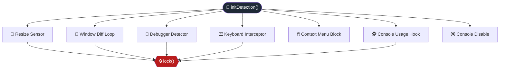
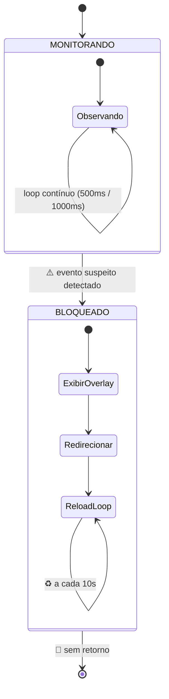
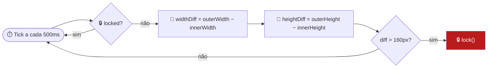
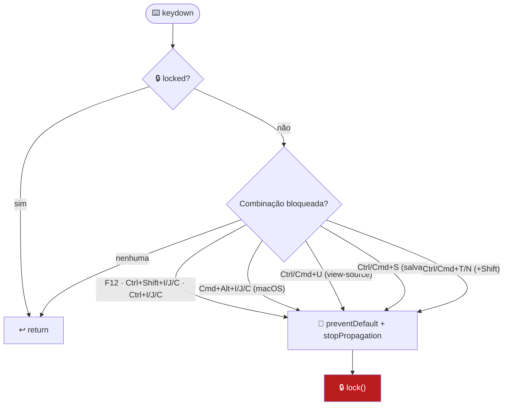
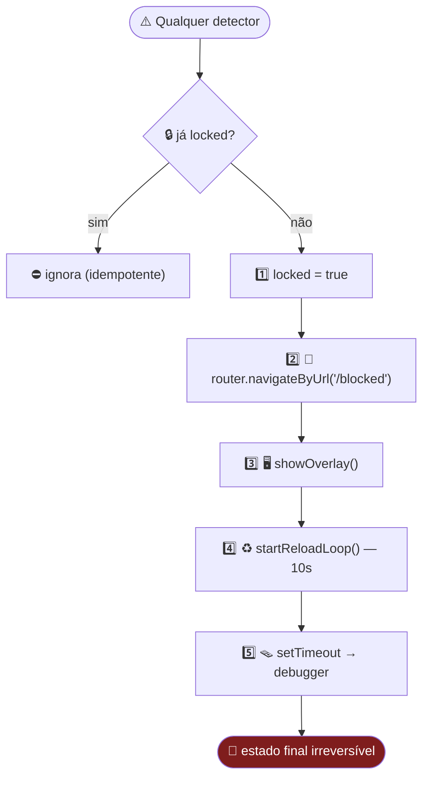
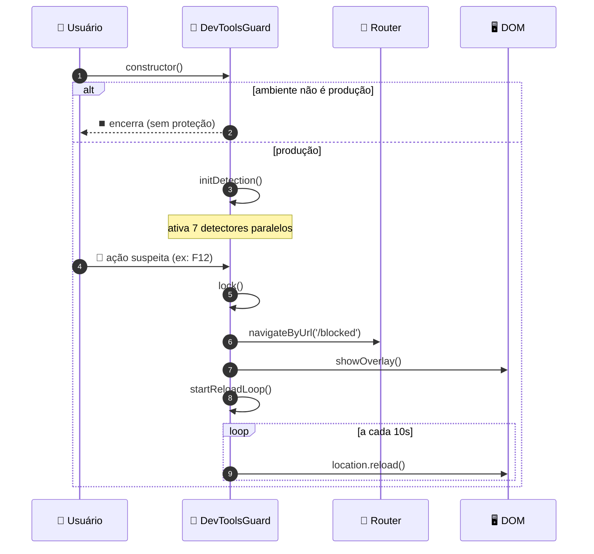

# 🔐 DevToolsGuard — Documentação Técnica

> Serviço responsável por detectar e bloquear o uso de DevTools, atalhos de inspeção e depuração em ambiente de produção.

---

## 📋 Sumário

- [🔐 DevToolsGuard — Documentação Técnica](#-devtoolsguard--documentação-técnica)
  - [📋 Sumário](#-sumário)
  - [🧠 Visão Geral](#-visão-geral)
  - [🔄 Máquina de Estados](#-máquina-de-estados)
  - [⚙️ Arquitetura de Detecção](#️-arquitetura-de-detecção)
  - [📏 Detecção por Dimensão de Janela](#-detecção-por-dimensão-de-janela)
  - [⌨️ Interceptação de Teclado](#️-interceptação-de-teclado)
  - [🧪 Detecção via `debugger`](#-detecção-via-debugger)
  - [🧱 Engine de Bloqueio (`lock()`)](#-engine-de-bloqueio-lock)
  - [🖥️ Sequência Completa](#️-sequência-completa)
  - [📦 Referência de Configuração](#-referência-de-configuração)
  - [🧠 Modelo Computacional — Síntese](#-modelo-computacional--síntese)

---

## 🧠 Visão Geral

O serviço ativa **7 detectores paralelos** assim que é instanciado. Qualquer detector que identifique um sinal suspeito aciona o mesmo ponto único de convergência: o **Lock Engine**.



---

## 🔄 Máquina de Estados

O sistema possui apenas dois estados, sendo `BLOQUEADO` um **estado absorvente** (irreversível durante o ciclo de vida da página).



---

## ⚙️ Arquitetura de Detecção

| Ícone | Detector | Gatilho | Intervalo |
|---|---|---|---|
| 📏 | Window Diff Loop | `outerWidth/Height` vs `innerWidth/Height` | `500ms` |
| 🔁 | Resize Sensor | evento `resize` | imediato |
| 🧪 | Debugger Detector | latência da instrução `debugger` | `1000ms` |
| ⌨️ | Keyboard Interceptor | `keydown` (F12, Ctrl+Shift+I, etc.) | imediato |
| 🖱️ | Context Menu Block | `contextmenu` | imediato |
| 🕵️ | Console Usage Hook | override de `console.log` | imediato |
| 🔇 | Console Disable | noop em `log/warn/error/info/debug` | uma vez |

---

## 📏 Detecção por Dimensão de Janela



> ℹ️ O mesmo cálculo é reaproveitado no listener de `resize`, com a diferença de ser **orientado a evento** em vez de polling.

---

## ⌨️ Interceptação de Teclado



---

## 🧪 Detecção via `debugger`

Técnica clássica de **timing attack**: a instrução `debugger` só introduz atraso perceptível quando o painel DevTools está aberto e pausa a execução.

```mermaid
sequenceDiagram
    participant Loop as ⏱️ setInterval (1000ms)
    participant JS as 🧵 Thread JS
    participant Guard as 🔐 DevToolsGuard

    Loop->>JS: início do tick
    JS->>JS: t0 = performance.now()
    JS->>JS: statement "debugger"
    Note over JS: pausa apenas se DevTools estiver aberto
    JS->>JS: t1 = performance.now()
    JS->>Guard: delta = t1 - t0
    alt delta > 50ms
        Guard->>Guard: 🔒 lock()
    else delta <= 50ms
        Guard-->>Loop: aguarda próximo tick
    end
```

---

## 🧱 Engine de Bloqueio (`lock()`)

Ponto único de convergência — idempotente via flag `locked`.



**Overlay (`showOverlay`)**
- 🖼️ `position: fixed`, cobre 100% da viewport
- 💨 `backdrop-filter: blur(20px)` + fundo semitransparente
- 🔝 `z-index: 2147483647` (máximo)
- 🚫 `pointer-events: all` — bloqueia qualquer interação com a página
- 📝 Mensagem: **"Acesso bloqueado"**

---

## 🖥️ Sequência Completa



---

## 📦 Referência de Configuração

| Constante | Valor | Descrição |
|---|---|---|
| `DEVTOOLS_THRESHOLD` | `160px` | limiar de diferença viewport/janela |
| `DETECTION_INTERVAL` | `500ms` | frequência do polling de dimensão |
| `DETECT_DEBBUGER` | `1000ms` | frequência do teste de `debugger` |
| `DETECT_DEBUGGER_END_START` | `50ms` | limiar de latência suspeita |
| `PAGE_RELOAD` | `10000ms` | intervalo do loop de reload pós-bloqueio |

---

## 🧠 Modelo Computacional — Síntese

| Característica | Implementação |
|---|---|
| 🔁 Máquina de estados | 2 estados, 1 absorvente (`BLOQUEADO`) |
| 📡 Arquitetura | Sistema reativo orientado a eventos + polling |
| 🧩 Sensores | 7 detectores paralelos e independentes |
| 🛡️ Estratégia | Heurísticas de detecção de inspeção (timing, geometria, atalhos) |
| 🧯 Fail-safe | Bloqueio total, irreversível e persistente (reload loop) |