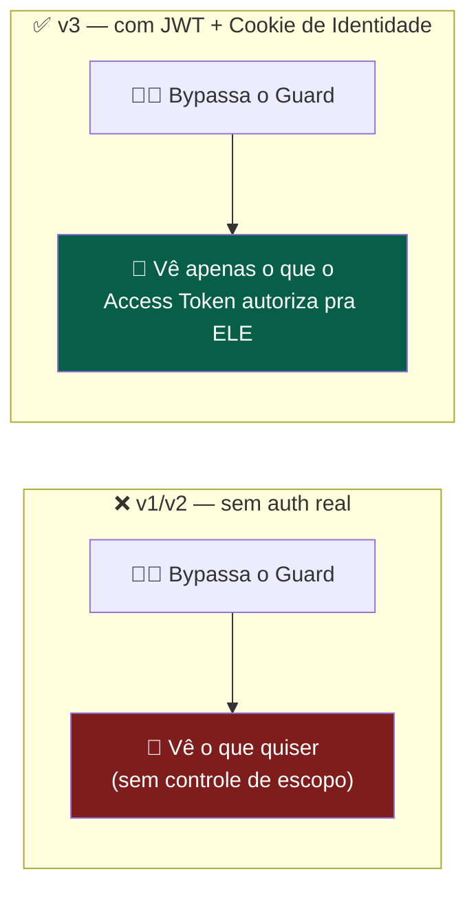
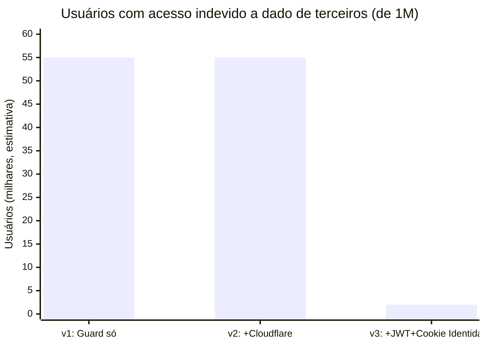
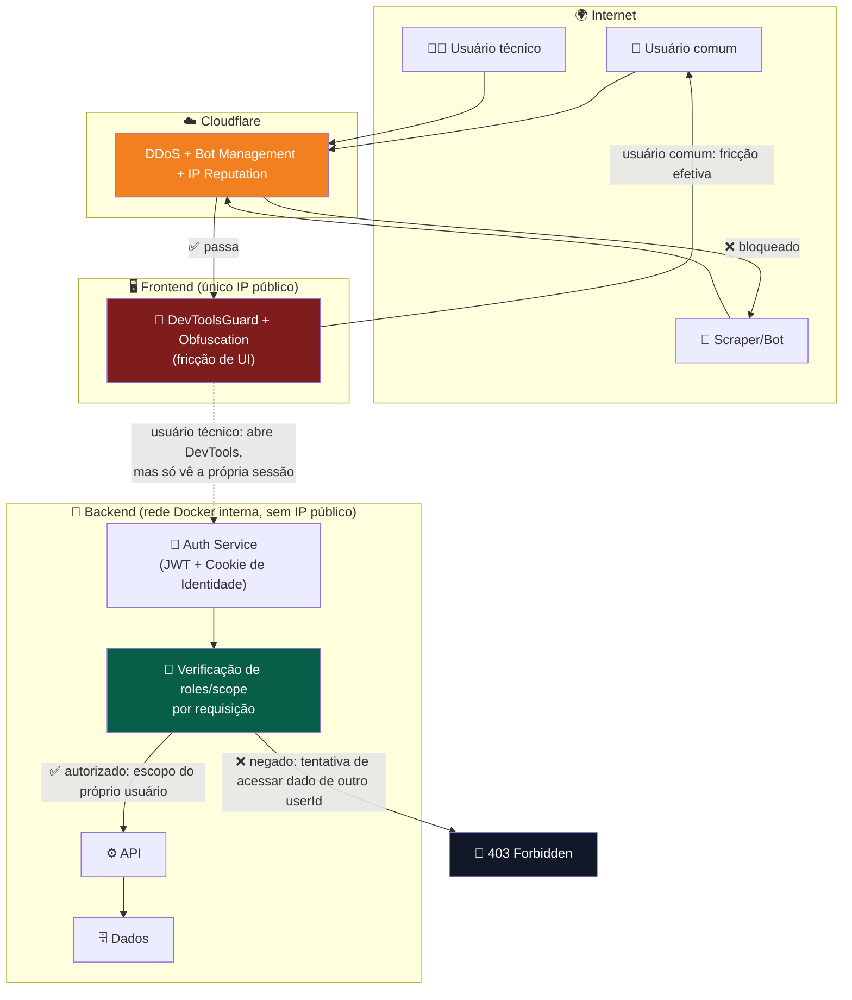
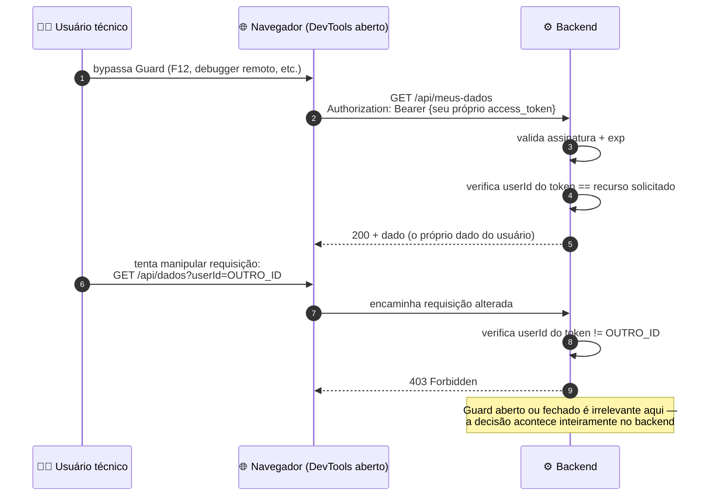
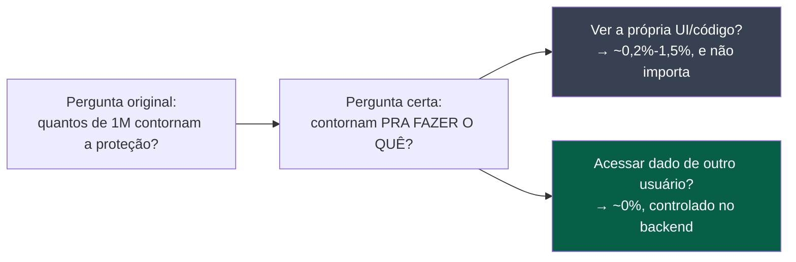

# 🛡️ Análise de Segurança Consolidada — DevToolsGuardService v3

> Terceira revisão da análise de segurança, agora considerando a camada de identificação real implementada em [Arquitetura de Autenticação — JWT + Cookie de Identidade Criptografado](./DevToolsGuard-Auth-JWT-Refresh.md). As revisões anteriores ([v1](./DevToolsGuard-Analise-Seguranca.md)) avaliaram apenas fricção client-side (Guard, Obfuscation) e proteção de borda (Cloudflare) — nenhuma delas controlava *quem* podia ver *qual* dado. Esta versão reavalia o cálculo de bypass à luz dessa lacuna agora fechada.

> ⚠️ **Aviso metodológico:** os percentuais seguem sendo **estimativas heurísticas** por perfil de comportamento, não uma auditoria formal, pentest ou dado telemétrico real.

---

## 📋 Sumário

- [🛡️ Análise de Segurança Consolidada — DevToolsGuardService v3](#️-análise-de-segurança-consolidada--devtoolsguardservice-v3)
  - [📋 Sumário](#-sumário)
  - [🎯 O que mudou desde a v1](#-o-que-mudou-desde-a-v1)
  - [🧩 A distinção que estava faltando](#-a-distinção-que-estava-faltando)
  - [📊 Estatística consolidada v3](#-estatística-consolidada-v3)
  - [🏗️ Arquitetura completa (macro)](#️-arquitetura-completa-macro)
  - [🔬 Visão micro — o que o bypass do Guard realmente entrega hoje](#-visão-micro--o-que-o-bypass-do-guard-realmente-entrega-hoje)
  - [🗺️ Matriz de risco final](#️-matriz-de-risco-final)
  - [✅ Conclusão](#-conclusão)

---

## 🎯 O que mudou desde a v1

Nas versões anteriores, todo o cálculo de "quantos de 1M de usuários conseguem contornar a proteção" respondia a uma pergunta incompleta: **contornar o quê, exatamente?**

- Nas v1/v2, o único "prêmio" por contornar o Guard era **inspecionar a própria sessão** — ver o próprio código-fonte, o próprio tráfego de rede, os próprios dados.
- Com a camada de **JWT + Cookie de Identidade** agora implementada, esse "prêmio" mudou de categoria: o usuário técnico ainda consegue abrir o DevTools, mas o dado que ele vê ali é **exatamente o mesmo que a API já autorizaria para ele** — nada além disso.

---

## 🧩 A distinção que estava faltando

Existem, na prática, **dois tipos de "bypass"** que a v1 tratava como se fossem a mesma coisa:

| Tipo de bypass | O que o atacante ganha | Camada que resolve |
|---|---|---|
| 🔍 **Bypass de inspeção** (abrir DevTools, ver o próprio código/tráfego) | Visibilidade sobre a *implementação* — nunca foi, por si só, acesso a dado de terceiro | Guard/Obfuscation reduzem, mas nunca eliminam — e **isso é aceitável**, porque o dado exposto já era dele |
| 🔓 **Bypass de autorização** (ver/alterar dado de outro usuário, escalar privilégio) | Acesso indevido de verdade | **JWT + Cookie de Identidade + verificação de `roles`/`scope` em cada rota** — é isso que efetivamente impede |

A v1 media o primeiro tipo e implicitamente alarmava como se fosse o segundo. Com a camada de autenticação implementada, o segundo tipo — o que de fato importa para confidencialidade de dados — passa a ter um piso de proteção real, independente do que acontece no navegador.

---

## 📊 Estatística consolidada v3

| # | Configuração | Contornam o Guard (inspeção) | Conseguem acessar dado de **outro usuário** | Por quê |
|---|---|---|---|---|
| 1 | Baseline (Guard puro) | 10.000 – 100.000 (1%–10%) | *dado não controlado por essa camada* | Guard nunca decidiu quem vê o quê |
| 2 | + Obfuscation | 2.000 – 15.000 (0,2%–1,5%) | *idem* | Reduz fricção de UI, não autorização |
| 3 | + Cloudflare (borda) | 2.000 – 15.000 (0,2%–1,5%) | *idem* | Filtra volumetria/bots, não autorização |
| 4 | **+ JWT + Cookie de Identidade** | 2.000 – 15.000 (0,2%–1,5%)¹ | **~0 por essa via** — depende de token roubado/válido, não de DevTools aberto | Autorização passa a ser verificada no backend, por requisição, independente do navegador |

¹ *Esse número não muda — abrir DevTools continua tão fácil quanto antes. O que muda é o que essa ação **entrega**: antes, potencialmente qualquer dado mal protegido; agora, apenas o que já era legítimo para aquele usuário ver.*

> 📉 A queda relevante não acontece nas camadas de borda/fricção — acontece exclusivamente quando a **autorização real** entra em cena. O número residual em v3 (~2 mil, estimado) não vem mais de "abrir F12", e sim do cenário descrito na seção seguinte: roubo efetivo de cookie/token, que é um problema fundamentalmente diferente.

---

## 🏗️ Arquitetura completa (macro)

---

## 🔬 Visão micro — o que o bypass do Guard realmente entrega hoje

**O ponto central:** o `DevToolsGuardService` nunca foi, e não precisa ser, a camada que impede acesso a dado de terceiro. Essa responsabilidade está — corretamente, agora — inteiramente na verificação de autorização do backend, que roda independente de qualquer coisa acontecendo no navegador.

---

## 🗺️ Matriz de risco final

| Ameaça | Camada responsável | Estado |
|---|---|---|
| Usuário leigo copiando conteúdo/UI | Guard + Obfuscation | 🟢 Mitigado (~90-99%) |
| Bot/scraper em massa | Cloudflare | 🟢 Mitigado |
| Proxy/VPN de datacenter | Cloudflare | 🟢 Mitigado |
| Usuário técnico inspecionando a **própria** sessão | Guard (parcial) | 🟡 Aceito como risco residual — não expõe dado de terceiro |
| Usuário acessando dado de **outro** usuário via manipulação de request | JWT + verificação de `roles`/`scope` | 🟢 Mitigado |
| Backend exposto diretamente à internet | Isolamento de rede Docker | 🟢 Mitigado |
| Roubo de cookie de identidade (XSS local, malware, dispositivo comprometido) | `HttpOnly` + rotação + detecção de reuso | 🟡 Mitigado, não eliminado — ver [documento de auth](./DevToolsGuard-Auth-JWT-Refresh.md#️-trade-offs-de-segurança-da-identificação-sem-login) |
| Impersonação sem segundo fator | Step-up authentication em ações sensíveis | 🟡 Depende de implementação — recomendado, não coberto pelo cookie sozinho |

---

## ✅ Conclusão

A pergunta "quantos usuários conseguem burlar o `DevToolsGuardService`" deixou de ser a pergunta relevante para segurança de dados a partir do momento em que a autorização passou a ser verificada no backend, por requisição, com base em identidade real (`JWT` + `Cookie de Identidade`). O Guard continua útil como **fricção de UX contra cópia casual**, mas a garantia de que "usuário X não vê dado de usuário Y" nunca dependeu — e não deveria depender — de nada que rode no navegador.

> 🧭 **Resumo em uma frase:** com JWT + Cookie de Identidade implementados, o piso de bypass do Guard permanece o mesmo de antes (~0,2%–1,5%), mas deixou de ser uma métrica de risco de dados — o risco real de dados agora se mede pela robustez da verificação de autorização no backend e pela resistência do cookie de identidade a roubo, não pela facilidade de abrir o DevTools.