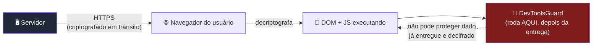
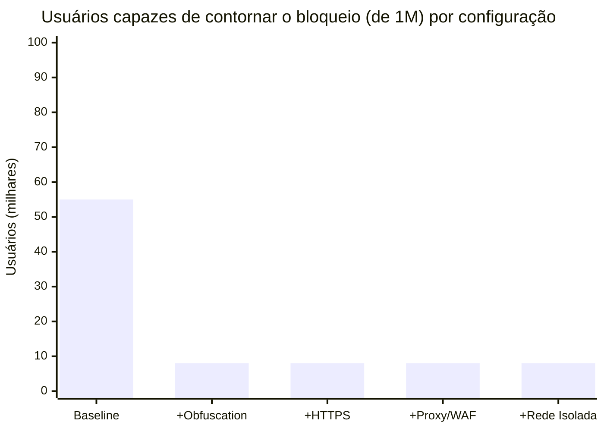
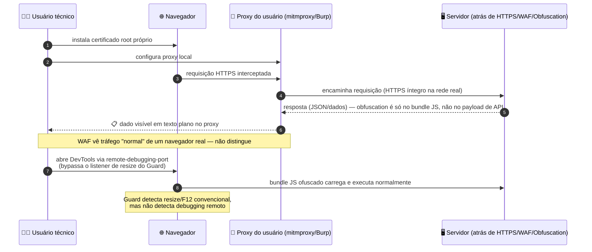
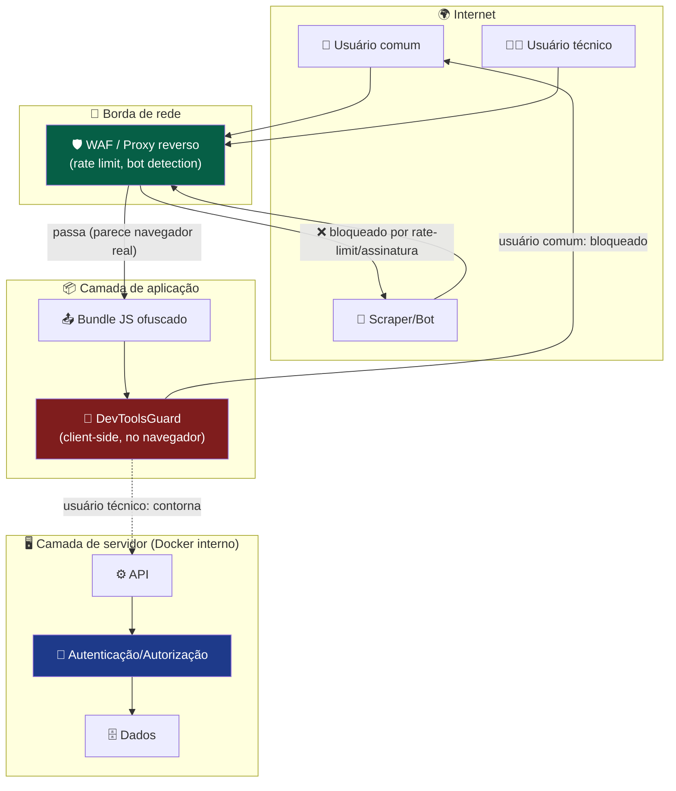
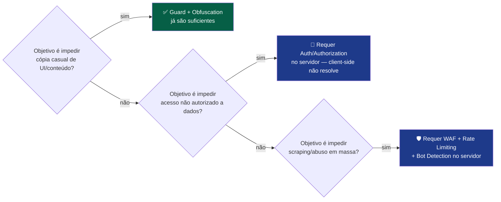

# 🛡️ Análise de Segurança Version 1  — DevToolsGuard

> ⚠️ **Aviso metodológico:** os percentuais apresentados neste documento são **estimativas heurísticas** baseadas em perfis de comportamento de usuário, não em uma auditoria de segurança formal, pentest ou dado telemétrico real. Servem para **raciocínio arquitetural**, não como métrica de compliance ou SLA de segurança.

---

## 📋 Sumário

- [🛡️ Análise de Segurança Version 1  — DevToolsGuard](#️-análise-de-segurança-version-1---devtoolsguard)
  - [📋 Sumário](#-sumário)
  - [🎯 Objetivo desta análise](#-objetivo-desta-análise)
  - [🧩 Premissa fundamental](#-premissa-fundamental)
  - [📊 Estatística consolidada](#-estatística-consolidada)
    - [📈 Leitura do resultado](#-leitura-do-resultado)
  - [🔬 Visão micro — mecanismo de bypass](#-visão-micro--mecanismo-de-bypass)
  - [🌐 Visão macro — camadas de infraestrutura](#-visão-macro--camadas-de-infraestrutura)
  - [🗺️ Matriz de decisão por cenário](#️-matriz-de-decisão-por-cenário)
  - [✅ Recomendação final](#-recomendação-final)

---

## 🎯 Objetivo desta análise

Estimar, para uma base de **1.000.000 de usuários ativos**, qual fração conseguiria contornar o bloqueio implementado pelo `DevToolsGuard`, e como essa fração se comporta ao adicionar camadas complementares:

1. Código atual (baseline)
2. + Obfuscation
3. + HTTPS
4. + Proxy/WAF
5. + Isolamento de rede (container não exposto à internet)

---

## 🧩 Premissa fundamental

Todo o `DevToolsGuard` é **código client-side**: ele executa dentro do navegador do usuário, *depois* que o bundle JS e os dados já foram entregues e descriptografados por esse navegador. Isso define um **piso técnico intransponível**: qualquer usuário com controle total sobre seu próprio ambiente de execução pode, em algum nível de esforço, observar ou interceptar o que já chegou até ele.

**Conclusão da premissa:** nenhuma combinação de obfuscation + HTTPS + proxy elimina esse piso — cada camada resolve um problema diferente, e nenhuma delas atua *depois* que o dado chega ao navegador do usuário legítimo.

---

## 📊 Estatística consolidada

| # | Configuração | Usuários que contornam (de 1M) | % | O que muda / por quê |
|---|---|---|---|---|
| 1 | **Baseline** (código atual) | 10.000 – 100.000 | 1% – 10% | Bloqueia usuário leigo; qualquer um com F12/extensão passa |
| 2 | **+ Obfuscation** | 2.000 – 15.000 | 0,2% – 1,5% | Grupo "curioso" desiste pela fricção; grupo técnico não é afetado |
| 3 | **+ HTTPS** | 2.000 – 15.000 | 0,2% – 1,5% | Sem alteração — HTTPS protege trânsito de rede, não inspeção local pós-entrega |
| 4 | **+ Proxy/WAF no servidor** | 2.000 – 15.000 (indivíduo)¹ | 0,2% – 1,5% | Sem alteração para usuário individual; reduz separadamente scraping/bots em massa |
| 5a | **+ Rede interna/VPN (cenário A)** | mesmo % **sobre uma população menor** | 0,2% – 1,5% *da população com acesso à rede* | Reduz quem *alcança* o app; não reduz quem *contorna* o Guard entre os que alcançam |
| 5b | **+ Container atrás de proxy público (cenário B)** | 2.000 – 15.000 | 0,2% – 1,5% | Sem alteração — usuário final da internet ainda recebe o bundle normalmente |

¹ *Proxy/WAF é eficaz contra abuso em escala (bots, scraping automatizado), não contra um usuário individual inspecionando a própria sessão já autenticada.*

### 📈 Leitura do resultado

> A maior queda acontece entre **Baseline → Obfuscation** (elimina o grupo "curioso"). Da metade em diante, a linha permanece praticamente **plana** — nenhuma dessas camadas ataca o piso técnico do usuário dedicado.

---

## 🔬 Visão micro — mecanismo de bypass

O que acontece, tecnicamente, quando um usuário do grupo "técnico/dedicado" contorna todas as camadas:

**Pontos-chave da visão micro:**
- 🔓 Obfuscation protege o **código-fonte JS**, não o **payload de dados** trafegado via API/JSON
- 🔀 Um proxy do lado do atacante intercepta o tráfego **depois** que o TLS é terminado no próprio navegador dele — HTTPS não impede isso
- 🐛 `--remote-debugging-port` e ferramentas de automação (Puppeteer/Playwright com `headless: false` modificado) não disparam os listeners de `resize`/`keydown` do Guard

---

## 🌐 Visão macro — camadas de infraestrutura

**Leitura da visão macro:**
- ✅ O **WAF/proxy** é eficaz contra o `Bot` (tráfego não-navegador, sem sessão, padrão de requisição anômalo)
- ❌ O **WAF/proxy** é ineficaz contra `User2`, porque ele usa um navegador real, com cookies/sessão legítimos — o tráfego *parece* humano porque *é* humano
- 🔑 A única camada que realmente decide **quem pode ver qual dado** é `Auth` (Autenticação/Autorização) na camada de servidor — é ali que o controle de acesso de fato acontece, não no `Guard`

---

## 🗺️ Matriz de decisão por cenário

| Cenário de infraestrutura | Reduz população total? | Reduz % de bypass entre quem acessa? |
|---|---|---|
| Container isolado (só rede interna/VPN) | ✅ Sim — só quem tem acesso à rede | ❌ Não |
| Container atrás de proxy público (internet) | ❌ Não — qualquer um da internet acessa | ❌ Não |
| + HTTPS | ❌ Não (já é padrão esperado) | ❌ Não |
| + Obfuscation | ❌ Não | ✅ Sim — elimina grupo "curioso" |
| + WAF/Rate limiting | ✅ Sim, mas só bots/scraping em escala | ❌ Não, para usuário individual |
| + Autenticação/Autorização robusta no servidor | ✅ Sim — impede acesso não autorizado de fato | ✅ Sim — é a única camada que resolve *ambos* |

---

## ✅ Recomendação final

| Se sua prioridade real é... | Piso estimado de bypass (de 1M) | Camada que resolve |
|---|---|---|
| UX/fricção contra usuário leigo | ~2.000 – 15.000 (0,2%–1,5%) | ✅ Guard + Obfuscation (já implementado) |
| Confidencialidade real de dados | depende 100% do servidor, não do client-side | 🔑 Auth/Authorization + isolamento de rede |
| Disponibilidade contra abuso em massa | irrelevante para o Guard | 🛡️ WAF + Rate Limiting |

> 🧭 **Resumo em uma frase:** o `DevToolsGuard`, mesmo com obfuscation, HTTPS e proxy somados, estabiliza em um piso de **~0,2%–1,5% de bypass** entre os usuários que alcançam a aplicação — e nenhuma dessas camadas client-side substitui autenticação e autorização como controle de acesso real a dados sensíveis.