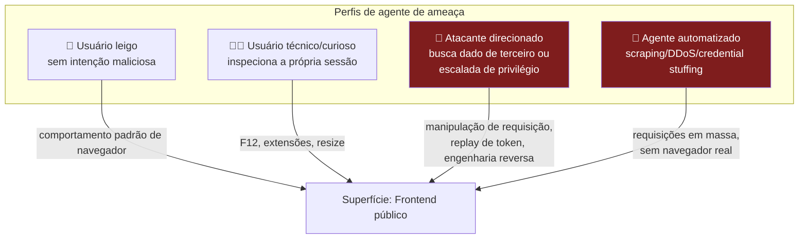
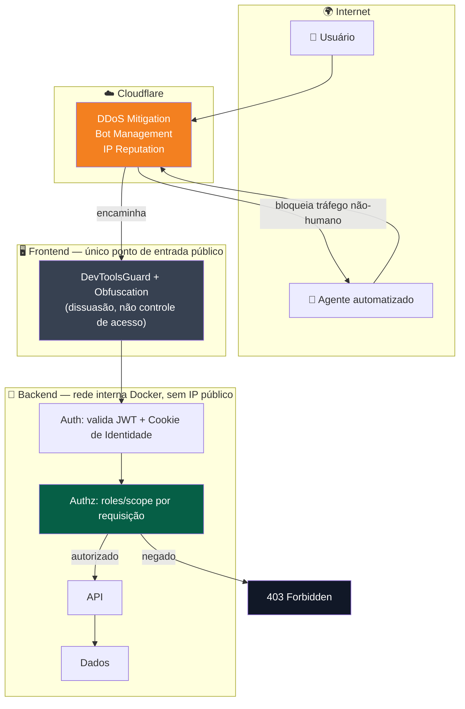
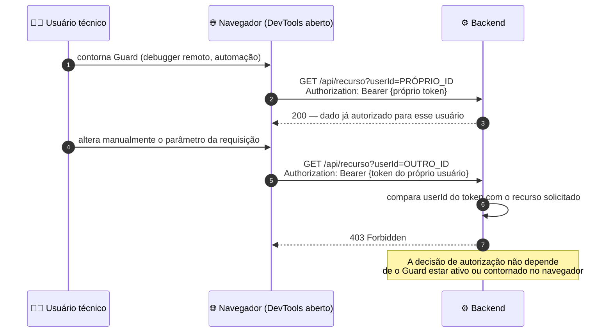

# 🛡️ Análise de Segurança Version 4 — DevToolsGuard

> **Documento de referência.** Substitui e consolida as versões anteriores desta análise. Complementar a [Arquitetura de Autenticação — JWT + Cookie de Identidade Criptografado](./DevToolsGuard-Auth-JWT-Refresh.md).

---

## 📋 Sumário

- [🛡️ Análise de Segurança Version 4 — DevToolsGuard](#️-análise-de-segurança-version-4--devtoolsguard)
  - [📋 Sumário](#-sumário)
  - [📝 Sumário executivo](#-sumário-executivo)
  - [🎯 Escopo e objetivo](#-escopo-e-objetivo)
  - [👤 Modelo de ameaças](#-modelo-de-ameaças)
  - [🧱 Camadas de defesa avaliadas](#-camadas-de-defesa-avaliadas)
    - [1. `DevToolsGuard` (client-side)](#1-devtoolsguard-client-side)
    - [2. Obfuscation do bundle](#2-obfuscation-do-bundle)
    - [3. Cloudflare (DDoS, Bot Management, IP Reputation)](#3-cloudflare-ddos-bot-management-ip-reputation)
    - [4. JWT + Verificação de `roles`/`scope` (backend)](#4-jwt--verificação-de-rolesscope-backend)
    - [5. Cookie de Identidade Criptografado + rotação](#5-cookie-de-identidade-criptografado--rotação)
    - [6. Isolamento de rede (backend em Docker, sem exposição pública)](#6-isolamento-de-rede-backend-em-docker-sem-exposição-pública)
  - [📊 Matriz de risco](#-matriz-de-risco)
  - [🏗️ Arquitetura de referência](#️-arquitetura-de-referência)
  - [🔬 Cenário de validação — por que a defesa client-side é limitada por design](#-cenário-de-validação--por-que-a-defesa-client-side-é-limitada-por-design)
  - [📚 Alinhamento com padrões da indústria](#-alinhamento-com-padrões-da-indústria)
  - [✅ Recomendações priorizadas](#-recomendações-priorizadas)
  - [⚠️ Nota metodológica](#️-nota-metodológica)

---

## 📝 Sumário executivo

O `DevToolsGuard` é um controle de **detecção e fricção no lado do cliente** (client-side), que dificulta a inspeção casual de uma aplicação Angular via DevTools. Ele é **eficaz para o que se propõe** — reduzir cópia casual de UI e desestimular curiosidade técnica não maliciosa — mas, por definição arquitetural, **não é e não pode ser um controle de confidencialidade de dados**.

A avaliação consolidada abaixo substitui as estimativas percentuais de versões anteriores por uma **matriz de risco qualitativa** (Probabilidade × Impacto), abordagem alinhada a frameworks reconhecidos (OWASP Risk Rating, NIST SP 800-30). Nenhum número de "usuários afetados" é apresentado como medição real — não há telemetria de produção sustentando esse tipo de estimativa, e apresentá-la como estatística seria impreciso.

**Conclusão central:** a confidencialidade real dos dados depende da camada de autenticação/autorização no backend (JWT + Cookie de Identidade + verificação de escopo por requisição), não do `DevToolsGuard`. Isso é esperado e correto — é assim que a indústria trata esse tipo de controle.

---

## 🎯 Escopo e objetivo

Avaliar, de forma tecnicamente defensável, o que cada camada da arquitetura atual **efetivamente garante**, distinguindo:

- **Controles de dissuasão** (deterrent controls) — elevam custo/esforço, não eliminam a ação
- **Controles preventivos** (preventive controls) — impedem a ação por mecanismo técnico, independente do esforço do agente
- **Controles detectivos** (detective controls) — identificam e reagem a uma tentativa

| Componente avaliado | Categoria de controle |
|---|---|
| `DevToolsGuard` (resize/keydown/debugger detection) | Dissuasão |
| Obfuscation do bundle JS | Dissuasão |
| Cloudflare (DDoS, Bot Management, IP Reputation) | Preventivo (borda) + Detectivo |
| JWT (Access Token) + verificação de `roles`/`scope` | Preventivo (autorização) |
| Cookie de Identidade Criptografado + rotação | Preventivo + Detectivo (reuso) |
| Isolamento de rede do backend (Docker interno) | Preventivo (superfície de ataque) |

---

## 👤 Modelo de ameaças

A distinção entre **T2** e **T3** é o ponto mais importante desta análise: são frequentemente tratados como o mesmo agente em análises informais, mas representam objetivos e superfícies de impacto completamente diferentes.

| Agente | Objetivo típico | Superfície relevante | Dado exposto em caso de sucesso |
|---|---|---|---|
| T1 — Usuário leigo | Nenhum, uso normal | — | Nenhum |
| T2 — Usuário técnico/curioso | Ver a própria implementação/tráfego | Frontend (client-side) | Apenas o que já era seu por autorização |
| T3 — Atacante direcionado | Acessar dado de outro usuário, escalar privilégio | Backend / camada de autorização | **Dado de terceiros — impacto real** |
| T4 — Agente automatizado | Volumetria, exfiltração em massa, força bruta de credenciais | Borda de rede | Depende de falha em rate limiting/auth |

---

## 🧱 Camadas de defesa avaliadas

### 1. `DevToolsGuard` (client-side)

**Mecanismo:** heurísticas de detecção (diferença de viewport, latência de `debugger`, interceptação de atalhos de teclado).

**O que garante:** nada de forma criptográfica ou estrutural — é fundamentalmente um conjunto de heurísticas executadas no ambiente que o próprio usuário controla. Qualquer heurística client-side é, por definição, **contornável por quem tem controle total sobre o runtime** (debugging remoto via protocolo DevTools, automação headless, interceptação de tráfego fora do navegador).

**Avaliação técnica honesta:** este é um controle de **UX/dissuasão**, análogo a um aviso "não copie este conteúdo" — eficaz contra o agente T1/T2 casual, irrelevante contra T3/T4.

### 2. Obfuscation do bundle

**Mecanismo:** minificação agressiva, renomeação de símbolos, encoding de strings, controle de fluxo ofuscado.

**O que garante:** aumenta o custo de engenharia reversa manual. Não impede execução (o navegador precisa rodar o código original para funcionar) nem protege o payload de dados trafegado via API — apenas o código-fonte do bundle.

### 3. Cloudflare (DDoS, Bot Management, IP Reputation)

**Mecanismo:** mitigação volumétrica via anycast, fingerprinting de requisição (JA3/TLS, comportamento), reputação de IP/ASN.

**O que garante:** controle efetivo de **borda de rede** — reduz significativamente tráfego não-humano e volumetria anômala antes de atingir o container. **Não** avalia identidade ou autorização de um usuário autenticado com navegador real — esse tráfego é, corretamente, classificado como legítimo.

### 4. JWT + Verificação de `roles`/`scope` (backend)

**Mecanismo:** token assinado, verificado a cada requisição, com autorização checada por recurso solicitado versus identidade do portador do token.

**O que garante:** este é o **único controle da lista com propriedade preventiva formal sobre confidencialidade de dados** — a decisão de "quem vê o quê" é feita no backend, por requisição, independente do que ocorre no navegador do cliente.

### 5. Cookie de Identidade Criptografado + rotação

**Mecanismo:** payload cifrado (AES-256-GCM), opaco ao cliente, com `tokenId` de referência validado contra store server-side; rotação a cada uso com detecção de reuso.

**O que garante:** integridade e confidencialidade do identificador de sessão em trânsito/repouso no cliente, e capacidade de revogação/detecção de roubo. **Não** garante segundo fator de autenticação — é um modelo de posse (*something you have*), sem *something you know/are* complementar.

### 6. Isolamento de rede (backend em Docker, sem exposição pública)

**Mecanismo:** ausência de rota de rede direta da internet para o backend; toda comunicação passa pelo frontend/rede interna do orquestrador.

**O que garante:** redução real da superfície de ataque de rede (nenhuma porta de backend disponível para scan/exploração direta). Não substitui autenticação — um agente com acesso legítimo à rede interna (funcionário, processo comprometido) ainda depende de autorização para acessar dados.

---

## 📊 Matriz de risco

Metodologia: **Probabilidade × Impacto**, com risco residual após controles implementados. Escala: 🟢 Baixo · 🟡 Médio · 🔴 Alto.

| Risco | Probabilidade (sem controle) | Impacto | Controle aplicado | Risco residual |
|---|---|---|---|---|
| Usuário leigo copia conteúdo de UI | Alta | Baixo | Guard + Obfuscation | 🟢 Baixo |
| Usuário técnico inspeciona a própria sessão | Alta | Baixo (só vê o próprio dado) | Guard (parcial) — aceito como residual | 🟢 Baixo |
| Scraping/bot em massa | Alta | Médio | Cloudflare (Bot Management) | 🟢 Baixo |
| DDoS volumétrico | Média | Alto | Cloudflare (mitigação anycast) | 🟢 Baixo |
| **Acesso a dado de outro usuário via manipulação de requisição** | Média | **Alto** | JWT + verificação de `roles`/`scope` | 🟢 Baixo (condicionado à correção da implementação de autorização) |
| **Backend exposto diretamente à internet** | — | **Crítico** | Isolamento de rede Docker | 🟢 Baixo |
| **Roubo do Cookie de Identidade (XSS, malware, dispositivo comprometido)** | Baixa–Média | **Alto** | `HttpOnly` + rotação + detecção de reuso | 🟡 Médio — mitigado, não eliminado |
| **Impersonação sem segundo fator** | Média | Alto | Nenhum controle nativo do modelo atual | 🟡 Médio — recomenda-se step-up authentication |
| Vazamento da chave de criptografia do backend (AES) | Baixa | Crítico | Secret manager + rotação de chave versionada | 🟡 Médio — depende de disciplina operacional |

> As duas linhas em 🟡 são as prioridades reais de hardening desta arquitetura — não o `DevToolsGuard`, que já está operando dentro do que é razoável esperar de um controle client-side.

---

## 🏗️ Arquitetura de referência

**Princípio arquitetural validado:** cada camada resolve exatamente uma classe de ameaça, sem sobreposição de responsabilidade que crie falsa sensação de redundância. Isso é **defense in depth** corretamente aplicado — não uma pilha de controles equivalentes.

---

## 🔬 Cenário de validação — por que a defesa client-side é limitada por design

Este cenário resume o motivo técnico pelo qual o `DevToolsGuard`, mesmo com obfuscation, HTTPS e Cloudflare somados, nunca teve como objetivo — nem deveria ter — impedir acesso a dados de terceiros. Essa responsabilidade pertence, corretamente, à camada de autorização do backend.

---

## 📚 Alinhamento com padrões da indústria

| Referência | Relevância para esta análise |
|---|---|
| **OWASP Top 10 (A01:2021 – Broken Access Control)** | Reforça que falhas de autorização (não de ofuscação de UI) são a categoria de risco mais crítica em aplicações web — exatamente o que a camada JWT + `roles`/`scope` endereça |
| **OWASP ASVS — V4 (Access Control)** | Estabelece que verificação de autorização deve ocorrer no servidor, por requisição, nunca confiando em controles client-side |
| **NIST SP 800-30 (Risk Assessment)** | Base metodológica para a matriz Probabilidade × Impacto usada aqui, em vez de estimativas percentuais sem base amostral |
| **CWE-602** (Client-Side Enforcement of Server-Side Security) | Descreve precisamente a limitação estrutural de qualquer controle como o `DevToolsGuard` quando tratado como mecanismo de segurança, e não de UX |

---

## ✅ Recomendações priorizadas

1. 🔴 **Confirmar que toda rota sensível do backend valida `roles`/`scope` contra o recurso solicitado** — não apenas a presença de um token válido. Esta é a mitigação real para o único risco de impacto Alto/Crítico ainda em aberto.
2. 🟡 **Implementar step-up authentication** (senha, OTP, biometria) para ações sensíveis, dado que o modelo de Cookie de Identidade é baseado em posse, sem segundo fator nativo.
3. 🟡 **Formalizar rotação e versionamento da chave AES** do Cookie de Identidade, com plano de resposta a incidente para revogação em massa em caso de comprometimento da chave.
4. 🟢 **Manter** `DevToolsGuard` e obfuscation como estão — cumprem seu papel de dissuasão de UX; não investir esforço adicional aqui esperando ganho de segurança de dados.
5. 🟢 **Manter** configuração atual do Cloudflare (Bot Management + IP Reputation) — adequada para a classe de ameaça de volumetria/automação que endereça.

---

## ⚠️ Nota metodológica

Este documento **não contém dados de telemetria de produção**. Toda avaliação de probabilidade/impacto é qualitativa, baseada em análise arquitetural e nos padrões referenciados. Para uma avaliação quantitativa real, seria necessário: (a) instrumentação de métricas de tentativas de bypass/anomalia detectadas em produção, ou (b) um teste de penetração formal conduzido por terceiro qualificado. Nenhuma das versões anteriores deste documento — nem esta — deve ser tratada como substituto de um pentest.